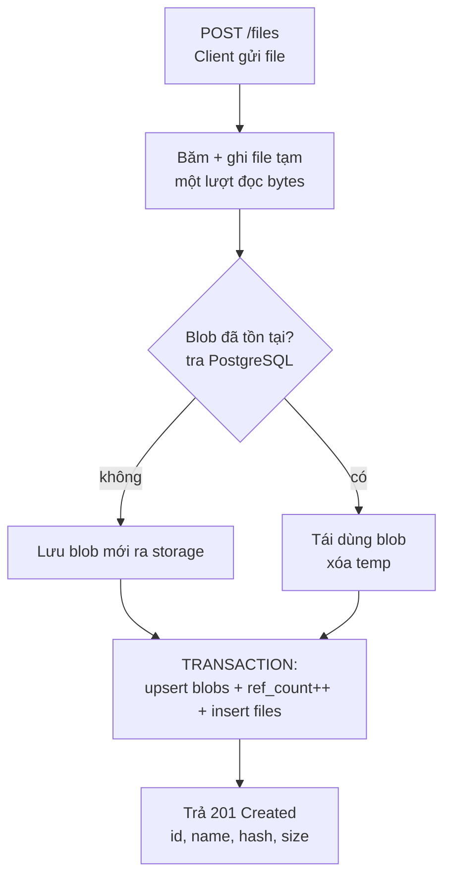

# Summary — System Design & Kiến thức cốt lõi

Tổng hợp các quyết định thiết kế và kiến thức đã thảo luận, để tra cứu khi code và khi phỏng vấn.

---

## 1. Mô hình tư duy quan trọng nhất

**Tên file và nội dung file là hai thứ tách rời.**

- **Blob** = bytes thật của file. Nặng. Lưu ở storage (disk/S3).
- **Metadata** = thông tin *về* file (tên, size, kiểu, upload lúc nào, trỏ vào blob nào). Nhẹ. Lưu ở PostgreSQL.
- Metadata là "nhãn dán" trỏ vào nội dung. Nhiều nhãn có thể trỏ vào cùng một nội dung → đây chính là nền tảng của dedup.

---

## 2. Database schema

### Bảng `files` (tầng metadata — cái user thấy)

| Cột | Kiểu | Ý nghĩa |
|---|---|---|
| `id` | UUID / BIGSERIAL, **PK** | Định danh duy nhất. URL `/files/{id}` dùng cái này. Tách định danh khỏi tên → tên trùng thoải mái |
| `name` | TEXT | Tên user đặt. Chỉ là thuộc tính, **không** phải khóa |
| `blob_hash` | TEXT, **FK** → `blobs.hash` | Con trỏ nối metadata với nội dung. Linh hồn của dedup |
| `content_type` | TEXT | MIME type. Cần cho `Content-Type` khi download |
| `created_at` | TIMESTAMPTZ | Thời điểm upload |

### Bảng `blobs` (tầng nội dung)

| Cột | Kiểu | Ý nghĩa |
|---|---|---|
| `hash` | TEXT (SHA-256 hex, 64 ký tự), **PK** | Định danh của blob **chính là nội dung**. Cùng nội dung → cùng hash → cùng dòng |
| `size_bytes` | BIGINT | Kích thước. Cần cho `Content-Length` |
| `storage_path` | TEXT | Bytes nằm ở đâu (disk path / S3 key) |
| `ref_count` | INT | Bao nhiêu file đang trỏ vào. Quyết định khi nào xóa blob an toàn |
| `created_at` | TIMESTAMPTZ | Thời điểm tạo blob |

**Quan hệ:** many-to-one. Nhiều `files` → một `blobs`. Chính sự tách bảng này **LÀ** thiết kế dedup, không phải tính năng thêm.

---

## 3. Các quyết định thiết kế đã chốt

| Vấn đề | Quyết định | Lý do |
|---|---|---|
| URL lấy file theo tên hay ID | **Theo ID** (`GET /files/{id}`), search theo tên riêng (`GET /files?name=...`) | ID không nhập nhằng; path param cho lookup, query param cho search (REST chuẩn) |
| Tên trùng | Cho phép (vì lookup theo ID) | Tên không cần unique |
| Status khi file không tồn tại | **404** + body JSON báo lỗi | Status code cho máy, body cho người. 200 cho lỗi = nói dối hạ tầng (cache/monitor hỏng) |
| Delete idempotent | Nghiêng về **204** cả 2 lần (idempotent) | Client retry không fail oan. Chấp nhận 404 nếu muốn báo đúng sự thật |
| Body upload M1 | **Raw body + `?name=`** | Đơn giản cho MVP. Multipart/chunked là bonus sau |
| Blob store | Local FS trước → S3 sau, bọc `BlobStore` interface | Local nhanh dựng; interface cho phép swap không sửa lõi |
| Repo | 2 repo (app + infra) | Lifecycle riêng; giá phải trả: phối hợp CI/CD qua image tag |

---

## 4. Deduplication & Content-Addressable Storage (CAS)

- **Vấn đề gốc:** lưu theo *tên* → 2 file nội dung y hệt, tên khác → lưu 2 bản → tốn gấp đôi.
- **CAS:** đặt khóa lưu trữ theo *nội dung* (hash), không theo tên.
- **Luồng:** băm nội dung → hash `H` → hỏi DB "blob `H` tồn tại chưa?" → chưa thì lưu, rồi thì tái dùng.
- Đây chính là cách **Git** lưu object, **Docker** chia layer, Dropbox dedup.
- **Dedup càng lợi với file lớn:** 1000 ảnh 5MB giống nhau → tiết kiệm ~5GB; chi phí băm gần như nhau.

---

## 5. Reference counting & khi nào set `ref_count`

**`ref_count` = bản cache của `SELECT COUNT(*) FROM files WHERE blob_hash = H`.** Nó đếm số dòng `files` trỏ vào blob.

**Ví dụ:**
- Upload `a.pdf` (hash H) → tạo blob, `ref_count = 1`.
- Upload `b.pdf` nội dung y hệt → cùng H → không lưu blob mới, `ref_count = 2`.
- Xóa `a.pdf` → **không** xóa blob (b vẫn dùng), chỉ `ref_count = 1`.
- Xóa `b.pdf` → `ref_count = 0` → giờ mới an toàn xóa blob.

**Ẩn dụ:** blob là đèn phòng chung; mỗi file là một người; người cuối rời phòng mới tắt đèn.

### Set `ref_count` lúc nào? → **Hướng B (cùng transaction với metadata)**

- **Hướng A (set lúc ghi blob):** `ref_count` cập nhật *trước* khi có dòng `files`. Nếu ghi metadata fail → `ref_count` nói dối, blob không bao giờ về 0 → rác vĩnh viễn (drift).
- **Hướng B (set cùng lúc ghi metadata, trong 1 DB transaction):** `INSERT files` + cập nhật `ref_count` thành công/thất bại cùng nhau. `ref_count` luôn khớp số dòng `files` thật.
- **Nguyên tắc:** cache phải cập nhật nguyên tử cùng nguồn sự thật nó cache (bảng `files`).

**Thứ tự đúng của một upload:**
1. Ghi bytes blob ra storage trước (idempotent — ghi trùng không sao). *Không* transact được cùng Postgres.
2. Trong **một** transaction DB: upsert `blobs` + tăng `ref_count` + insert `files`.
3. Storage OK mà transaction fail → orphan bytes → GC quét sau (`WHERE ref_count = 0`). Không bao giờ có metadata trỏ vào blob không tồn tại.

---

## 6. Copy-on-Write (COW)

- **Khái niệm:** nhiều bên cùng dùng một khối dữ liệu shared; chỉ khi có bên *ghi* mới copy riêng cho bên đó.
- **Xuất hiện ở:** Linux `fork()`, ZFS/Btrfs/APFS snapshot, Git branch, Docker layer.
- **Liên hệ project:** file immutable sau upload → dedup + shared blob **chính là một dạng COW** (không bao giờ có write → không bao giờ copy).
- **Khi nào COW lộ rõ:** nếu hỗ trợ edit/versioning (`PUT /files/{id}`) → edit `a.pdf` đang share blob H: tạo blob mới H', đổi pointer của a sang H', giảm ref của H. **Không sửa blob H tại chỗ** (sẽ phá file khác đang share).
- **Cần làm gì thêm cho Phase 1–2?** Không. Dedup + ref_count = COW dưới điều kiện immutable.

---

## 7. SHA-256 — tính chất cần nắm

- **Fixed-length output:** đầu vào bao nhiêu cũng cho ra đúng 256 bit = 64 ký tự hex. File 1 byte hay 1 TB → hash 64 ký tự.
- **Merkle–Damgård:** xử lý theo block 512-bit, giữ state 256-bit, `state = f(state, block)`. **Không cần cả file trong RAM để băm** → hợp streaming.
- **Avalanche effect:** đổi 1 bit đầu vào → ~50% bit đầu ra lật, pseudo-random. Đổi 1 ký tự (đầu/giữa/**cuối**) → hash khác **hoàn toàn**, không tương quan. → hash dùng làm định danh nội dung an toàn, không đoán ngược được.
- **Collision:**
  - Về lý thuyết **có** (pigeonhole: đầu vào vô hạn, đầu ra hữu hạn $2^{256}$).
  - Thực tế xác suất ~$2^{-128}$ (birthday paradox). $2^{256} \approx 10^{77}$ ≈ số nguyên tử trong vũ trụ quan sát được.
  - **Không phụ thuộc kích thước file**, chỉ phụ thuộc *số lượng* file.
  - **Kết luận:** không cần xử lý collision. Câu trả lời phỏng vấn: "lý thuyết có theo pigeonhole; thực tế ~$2^{-128}$ nên bỏ qua".

---

## 8. Streaming (xử lý file lớn không OOM)

- **Sai:** nạp cả file vào RAM → file 2GB → OOM, process bị kernel kill.
- **Sai (hiểu nhầm):** "đọc từng 100MB rồi gom lại trong RAM" — vẫn gom trong RAM.
- **Đúng — streaming:** cấp buffer nhỏ cố định (Go ~32KB). Lặp: đọc 1 chunk → ghi ngay xuống disk → ghi đè buffer → lặp. **RAM dùng = kích thước buffer (hằng số), không phụ thuộc file.** File hoàn chỉnh nằm trên disk, lớn dần do append.
- **Băm + ghi cùng lúc:** cho dòng bytes đi qua 2 đường ống song song — [update SHA-256] + [ghi temp file] — **một lượt đọc duy nhất**. Chi phí băm không đáng kể (~vài GB/s, nhanh hơn disk/network).
- **Phải ghi temp file trước** (không ghi thẳng tên `H`) vì chưa đọc hết thì chưa biết `H`.
- **Go keywords:** `io.Reader`/`io.Writer`, `io.Copy`, `io.MultiWriter`, `io.TeeReader`, `crypto/sha256` (`sha256.New()` trả về `io.Writer`), `multipart.Reader`.

---

## 9. API Contract (nháp Phase 1)

| Method | Path | Request | Success | Lỗi |
|---|---|---|---|---|
| `POST` | `/files` | raw body + `?name=` (M1); multipart sau | `201` + JSON `{id, name, hash, size}` | `400` thiếu name, `413` quá lớn |
| `GET` | `/files/{id}` | — | `200` + bytes (+ `Content-Type`, `Content-Disposition`) | `404` |
| `GET` | `/files?name=...` | query param | `200` + danh sách | — |
| `DELETE` | `/files/{id}` | — | `204` (idempotent) | `404` (nếu chọn báo đúng) |

---

## 10. Luồng một lần upload (M5–M6)

**Điểm cần khắc sâu:**
- "Băm + ghi temp" là **một** bước (một lượt đọc bytes).
- DB chạm 2 lần: hỏi "blob tồn tại?" (điểm rẽ) + ghi metadata (transaction).
- Nhánh "tái dùng" là dedup tiết kiệm chỗ: không ghi byte nào lên storage.
- `ref_count` được set **trong transaction ghi metadata**, không phải lúc ghi blob (xem mục 5).

---

## 11. Các câu hỏi thiết kế & hướng giải (Requirement 1)

| # | Câu hỏi | Hướng giải |
|---|---|---|
| 1 | Bytes đi qua đâu lúc upload? | Stream vào temp file local, vừa ghi vừa băm (phải qua temp vì chưa biết `H`) |
| 2 | Commit metadata trước/sau ghi bytes? | **Blob trước, metadata sau** (write-ahead). DB-first fail → read vỡ; blob-first fail → orphan (GC dọn) |
| 3 | Race: 2 client upload cùng nội dung? | DB làm trọng tài: `hash` UNIQUE + `INSERT ON CONFLICT DO NOTHING`; ref_count `UPDATE ... +1` atomic |
| 4 | Blob lưu ở đâu? | Phase 1 local FS → sau S3, qua `BlobStore` interface |
| 5 | Đặt tên blob / sharding? | Dùng hash làm key. S3 hiện đại không cần shard prefix; local FS **nên** shard 2–4 ký tự đầu |
| 6 | Download: proxy hay presigned? | Local FS buộc proxy; S3 dùng presigned URL (offload bandwidth, expiry ngắn) |
| 7 | Search theo tên? | Exact (B-tree) trước; substring cần GIN + pg_trgm |
| 8 | List + pagination? | Keyset/cursor (`WHERE id > last_id`) production; offset/limit cho MVP |
| 9 | Upload fail giữa chừng? | `defer` cleanup (process còn sống) + janitor job (crash) |
| 10 | Orphan blob? | GC job quét `ref_count = 0` (có grace period); hoặc reconciliation storage vs DB |

---

## 12. Concurrency (M1 trở đi)

- Go: mỗi request một goroutine → nhiều goroutine cùng chạm 1 `map` → **panic** (concurrent map write).
- Bảo vệ bằng `sync.RWMutex`: `Lock` cho ghi (`put`/`delete`), `RLock` cho đọc (`get` — cho nhiều reader song song).
- Ở tầng DB: dùng UNIQUE constraint + atomic UPDATE thay vì read-then-write ở app code (tránh lost update).

---

## 13. Multipart vs Chunked upload (phân biệt)

- **`multipart/form-data`** (HTTP content type): cách đóng gói body trong *một* request. Form HTML dùng cái này. Đối lập: raw body.
- **Chunked/Resumable upload** (protocol): chia file lớn thành *nhiều* request, server ghép lại. Cho resumable, parallel, progress. Ví dụ: S3 Multipart Upload, TUS.
- Hai tầng **độc lập**. Challenge này: Phase 1 dùng raw/multipart đơn request; chunked là bonus (phức tạp gấp 3–5 lần).
- AWS SDK Go `s3manager.Uploader` **tự động** dùng S3 Multipart khi file lớn — không cần code tay.